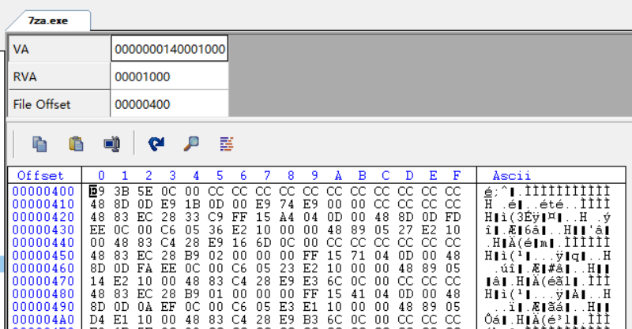
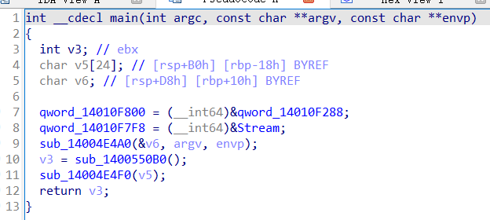
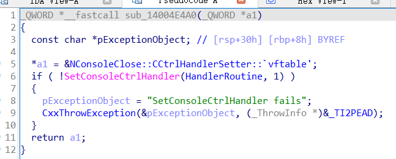
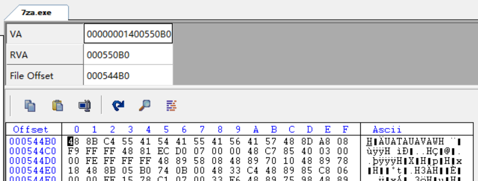
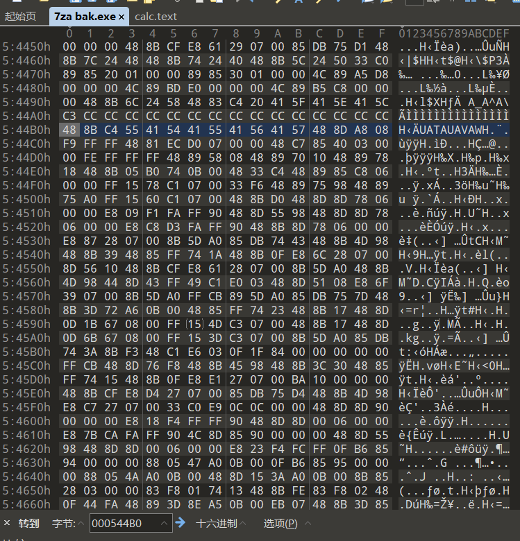
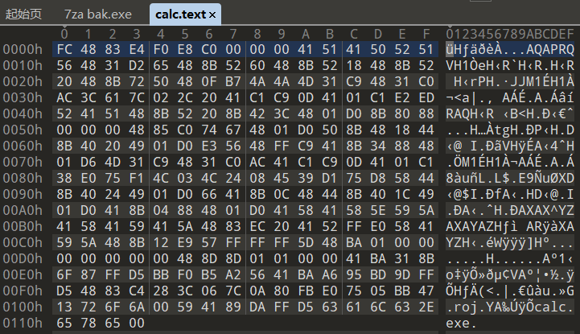
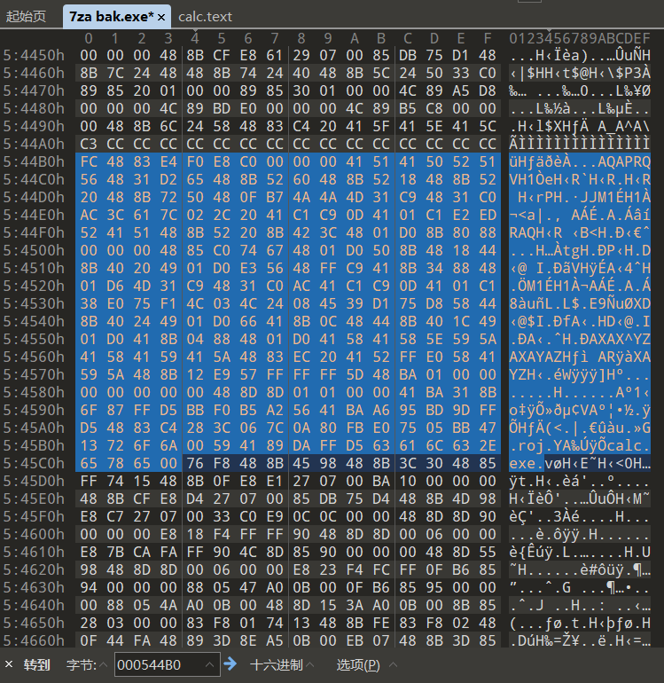
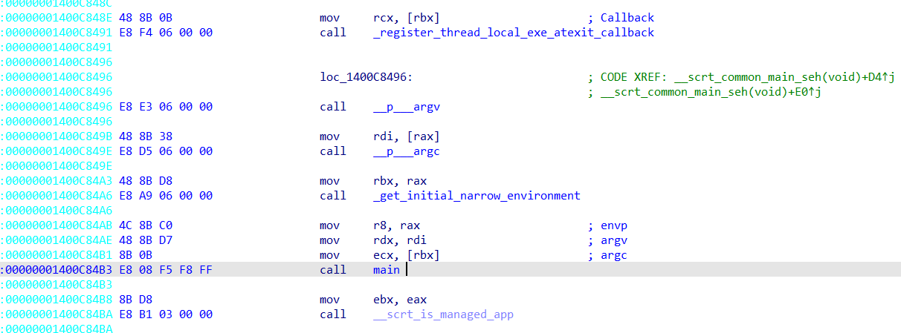
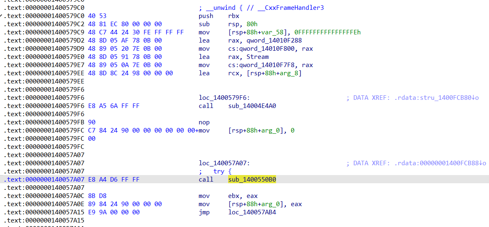
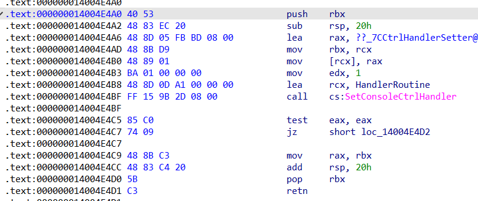

# BinarySpy

> A tool for manual or automatic patch shellcode into binary file Oder to bypass AV.
>
> 一个手动或自动patch shellcode到二进制文件的工具

## 1.GUI

## 2.使用方法

+ 待修改的pe文件路径就是要被patch shellcode的pe文件
+ VA
  + 手动:要修改PE文件的VA就是该pe文件的要被patch虚拟地址
  + 自动:无需填写VA
+ 待覆盖的.text文件就是shellcode的text段
  + 内容可自动提取或者选择非.exe结尾的文件作为.text文件
+ 可选fuzz模式，操作同上，但是会生成多个patch后的文件
+ 最后,点击执行即可
+ 注意:仅限于x64的程序patch且语言为C,其他语言适配请等更新,shellcode请自己实现,calc的shellcode特征已被标记

# 一种基于patch免杀技术的自动化实现

## 起因

先从一个样本分析开始 https://www.52pojie.cn/thread-1900852-1-1.html

从标题“三年了，还是VT全绿，它到底凭什么？”

可以分析得到这个样本的静态特征非常不明显

具体原因简单来说就是：白文件执行流程中的某函数被修改为恶意shellcode代码

## 理论

+ 你需要掌握的

  + PE文件结构
  + shellcode编写
  + IDA基础分析
+ 我来讲讲 例子:7za.exe

  + 
  + 先来一个概念 地址
    + 虚拟地址 但PE bear给的虚拟地址是RVA
    + 用CFF Explorer转换一下
    + 
    + VA就是0000000140001000
    + FO文件偏移就是00000400
  + IDA分析
    + 将例子程序拖入IDA
    + 
    + IDA贴心的直接定位到了main函数
    + 这个程序的main函数调用的函数只有两个

      + sub_14004E4A0
      + sub_1400550B0
    + **既然要patch就得满足几个条件**

      + **目标函数大**
      + **目标函数必定在主函数执行流程中**
      + **目标函数尽量在text段首**
      + **要patch的shellcode体积尽量小**
    + 

      + sub_14004E4A0 太小了 不行
    + 

      + sub_1400550B0 很大 可以
    + 用CFF转换得到FO

      + 
    + 000544B0
    + 用010手动开始patch

      + 
      + 
      + 
    + patch完后打开就弹计算器了 这里作为测试 实战中可以换为自己编写的shellcode

      > https://github.com/clownfive/CppDevShellcode
      >

## 自动化

> 以下例子只争对提供的程序

+ 思考一个问题：怎么实现该流程的自动化patch？
+ 回答

  + 手动的patch方法无非就是：1.找到要patch的函数VA 2.VA转OF 3.直接替换为shellcode
+ 缺漏

  + 怎么找到符合条件的函数？
+ 大部分人遇到这些问题都觉得 我只要反汇编PE文件 然后转伪代码就知道哪个函数符合条件了，可是这个说起来容易，实践起来可要自实现一个disassembler啊！而且要讲究不同编译器，不同架构，甚至不同语言的差异！
+ 思路

  + 找函数的push ebp rbp，sub esp rsp，作为函数开头特征
+ 根据思路找到了函数

  + 但是出现问题，函数是有执行调用流程的
  + 比如main函数，被crt运行时函数调用
  + 而crt被start函数(entrypoint))调用
+ 那咋办？

  + 寻找特征
  + 通常，在初始化时，CRT 会调用  **`__security_init_cookie`** 。 如果绕开 CRT 初始化（例如，使用 [`/ENTRY`](https://learn.microsoft.com/zh-cn/cpp/build/reference/entry-entry-point-symbol?view=msvc-170) 指定一个入口点），则必须自己调用  **`__security_init_cookie`** 。 如果不调用  **`__security_init_cookie`** ，全局安全 Cookie 将设定为默认值，缓冲区溢出保护将受到威胁。 由于攻击者可利用此默认 Cookie 值使缓冲区溢出检查无效，我们建议，在定义自己的入口点时，始终调用  **`__security_init_cookie`** 。
  + 而crt函数通常作为第二个call调用
+ 那就找索引为1的函数就可以了！我真聪明！

  + **没错，你已经解决了一个问题**
+ crt的魔鬼关

  + 进入crt函数的你，懵了，给我干哪来了，这还是国内吗？
  + 古怪的函数调用 不同编译器的程序的crt都是不一样的
  + 而且全是call
  + 这下还能用索引吗？不能！
+ 闯出crt

  + 经过大量c程序(x64)分析
  + 每个crt调用主函数的时候都会有同一个特征
  + **mov r8,xxx**
  + 我们找到这段操作码的地址为索引找往下最近的call不就找到main函数了嘛？
  + **真聪明，又解决了一个问题**
+ 险恶的主

  + 过了crt到主函数了，哥们特征哪去了？怎么全是call啊也！
  + 虽然我们知道要patch的是sub_1400550B0
  + 但是在这之前有很多call，每个程序的call数量都不一样所以不能用索引定位，也没有同一个特征
+ 主，看看你的ret

  + 先进到sub_14004E4A0看看函数结构
  + sub_14004E4A0你好短！一会儿就C3(ret)了
  + 学过pwn的大佬已经发现了规律
  + pusb rbx到ret的地址理论上也代表了函数的相对大小
  + 我们用后者减去前者不久得到了这个大小嘛？
  + **你好聪明！太棒了**

## 实现

### BinarySpy 程序流程文档

#### 简介

BinarySpy 是一个用于修改 PE 文件的工具，主要功能包括提取 .text 节区和覆盖 .text 节区。程序使用 `tkinter` 进行图形界面展示，依赖于 `pefile` 和 `capstone` 库进行 PE 文件操作和反汇编。

#### 程序依赖

- Python 3.x
- tkinter
- pefile
- capstone
- os

#### 主要功能

1. 提取 PE 文件中的 .text 节区。
2. 使用新的 .text 节区数据覆盖已有的 PE 文件。
3. 自动检测和 patch 代码段。

## 详细流程

### 1. VA 转换为 RVA

函数：`va_to_rva(pe, va)`

- 输入：PE 文件对象 `pe`，虚拟地址 `va`
- 输出：相对虚拟地址 `rva`

### 2. RVA 转换为文件偏移

函数：`rva_to_offset(pe, rva)`

- 输入：PE 文件对象 `pe`，相对虚拟地址 `rva`
- 输出：文件偏移 `offset`

### 3. 替换 .text 节区

函数：`replace_text_section(pe_file_path, text_bin_path, va)`

- 输入：PE 文件路径 `pe_file_path`，新的 .text 文件路径 `text_bin_path`，虚拟地址 `va`
- 流程：
  1. 将 VA 转换为 RVA。
  2. 将 RVA 转换为文件偏移。
  3. 用新的 .text 数据覆盖原 PE 文件中对应的部分。

### 4. 提取 .text 节区

函数：`extract_text_section(pe_path, output_path)`

- 输入：PE 文件路径 `pe_path`，输出文件路径 `output_path`
- 流程：
  1. 读取 PE 文件。
  2. 查找 .text 节区。
  3. 提取 .text 节区数据并保存到指定文件。

### 5. 浏览文件

函数：`browse_file(entry, title, filetypes)`

- 输入：文本框 `entry`，对话框标题 `title`，文件类型 `filetypes`
- 流程：
  1. 打开文件浏览对话框。
  2. 获取选择的文件路径。
  3. 将文件路径显示在文本框中。

### 6. 校验十六进制字符串

函数：`is_hex(s)`

- 输入：字符串 `s`
- 输出：布尔值，表示是否为有效的十六进制数

### 7. 检查文件可读性

函数：`check_file_readable(file_path)`

- 输入：文件路径 `file_path`
- 输出：布尔值，表示文件是否存在且可读

### 8. 执行功能

函数：`execute()`

- 流程：
  1. 获取用户输入的 PE 文件路径、VA 和 .text 或 PE 文件路径。
  2. 校验输入的有效性。
  3. 根据用户输入决定提取 .text 节区或直接覆盖 .text 节区。
  4. 提示操作成功或失败。

### 9. 自动 Patch 代码段

函数：`find_crt_function(pe_path)` 等系列函数

- 流程：
  1. 查找CRT函数入口点。
  2. 查找CRT函数中mov r8操作指令。
  3. 查找mov r8向下附近的call，找到main函数。
  4. 查找main函数中call的函数，同时分析函数开头到ret的地址大小，若符合即为可patch函数。

### GUI 界面

- 使用 `tkinter` 创建图形用户界面。
- 包含文本框、标签、按钮等元素，用户通过界面进行文件选择和操作。
- 主界面启动后，用户可以选择待修改的 PE 文件、输入 VA 和 .text 或 PE 文件路径，点击“执行”按钮开始操作。

## 注意事项

+ 目标pe为x64 c程序
+ 确保crt为程序入口第二个jmp
  + 不同编译器 编译器选项可能导致不同
+ shellcode请尽量小
+ patch函数必须为执行流程中被调用的
+ patch函数尽量找大的
+ patch后数字签名会失效

## 参考

https://mp.weixin.qq.com/s/b0mphQG-nny0X087JsjsKQ

https://www.52pojie.cn/thread-1900852-1-1.html

https://learn.microsoft.com/zh-cn/cpp/c-runtime-library/reference/security-init-cookie?view=msvc-170

## 免责声明

(1) 本项目仅用于网络安全技术的学习研究。旨在提高安全开发能力，研发新的攻防技术。

(2) 若执意要将本项目用于渗透测试等安全业务，需先确保已获得足够的法律授权，在符合网络安全法的条件下进行。

(3) 本项目由个人独立开发，暂未做全面的软件测试，请使用者在虚拟环境中测试本项目功能。

(4) 本项目完全开源，请勿将本项目用于任何商业用途。

(5) 若使用者在使用本项目的过程中存在任何违法行为或造成任何不良影响，需使用者自行承担责任，与项目作者无关。
